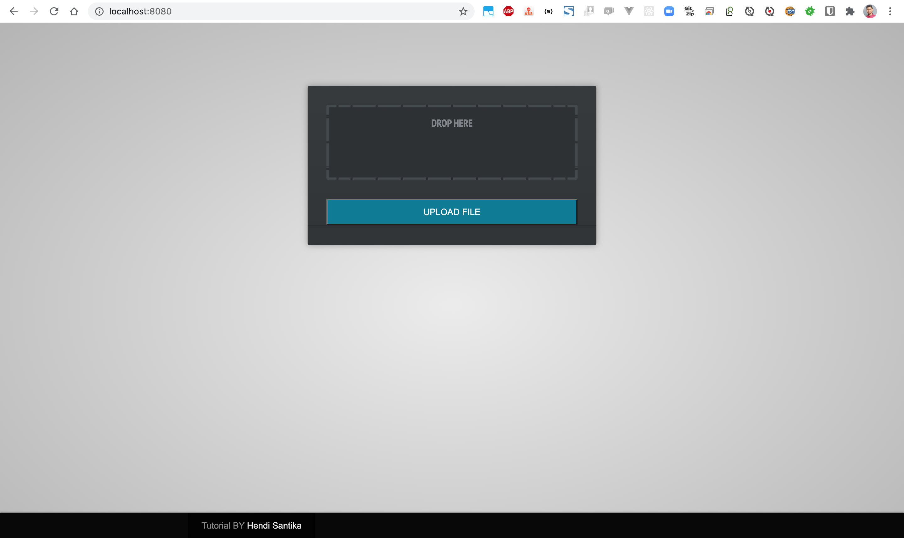
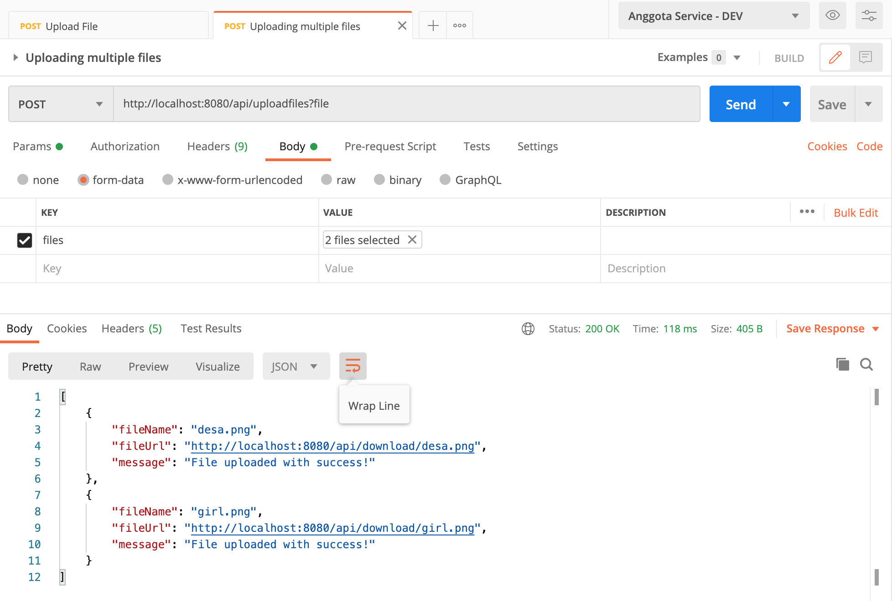
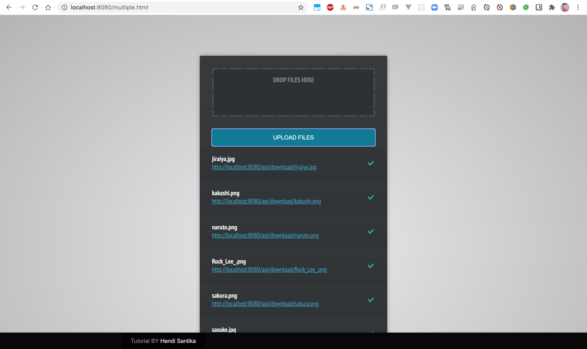
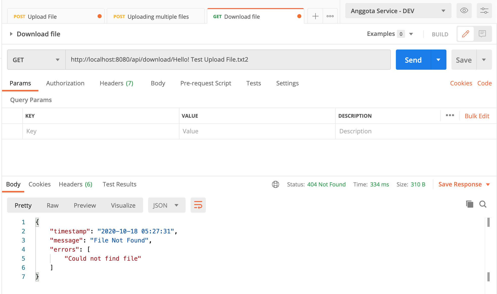

# springboot-upload-download
### Things todo list:
1. Clone this repository: `git clone https://github.com/hendisantika/springboot-upload-download.git`
2. Go inside the folder: `cd springboot-upload-download`
3. Run the application: `mvn clean spring-boot:run`
4. Open your favorite REST Client such as POSTMAN

### Images Scree shot
Upload Single File

Upload Multiple File

Download File

